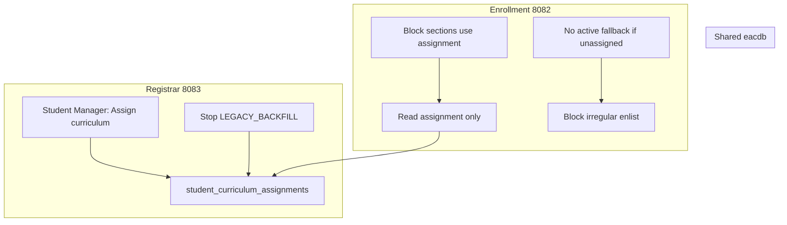

# Implementation Plan — Explicit Curriculum Assignment (Registrar + Enrollment)

Last updated: 2026-06-10  
**Prerequisite:** `PROPOSAL_EXPLICIT_CURRICULUM_ASSIGNMENT.md`  
**Apps:** Registrar (`8083`), Enrollment (`8082`), shared `eacdb`  
**Estimate:** ~3–4 focused dev days (phases C1–C3); phase C4 docs + UAT +1 day

**Do not start both apps in one big bang** — follow phase order below; each phase has exit criteria before the next.

---

## Overview



---

## Phase C1 — Registrar: explicit assign + stop backfill

**Goal:** Staff can assign catalog without program shift; Registrar stops creating silent `LEGACY_BACKFILL` rows.

### C1.1 `StudentCurriculumService.java`

| Change | Detail |
|--------|--------|
| **New** `hasCurrentAssignment(String studentNumber)` | `findCurrentCurriculumId != null` |
| **Change** `resolveOrAssignCurrentCurriculum` | **Rename behavior:** split into `resolveCurrentCurriculum` (read only, no insert) and keep `resolveOrAssign` only for admission/backfill opt-in OR remove backfill entirely |
| **Recommended** | Add `requireCurrentCurriculumId(sn)` → returns id or throws/empty; **delete** auto-insert in `resolveOrAssign` |
| **New** `assignCurriculumManual(...)` | Wrapper calling `assignCurriculum` with type `MANUAL` or `RETURNING` |
| Update callers | See C1.3 |

**Assignment types (normalize):**

- `RETURNING` — staff assign on re-enrollment  
- `MANUAL` — correction / data fix  
- Keep: `NEW_ENTRANT`, `TRANSFEREE`, `PROGRAM_SHIFT`

### C1.2 `EnrollmentController.java` (Registrar portal)

| Endpoint | Purpose |
|----------|---------|
| `POST /admin/student-manager/assign-curriculum` | `studentNumber`, `curriculumId`, `assignmentType` (`RETURNING`\|`MANUAL`), `reason` |
| GET Student Manager | Pass `hasCurriculumAssignment`, `currentCurriculum`, `assignableCurricula` (already partial) |

Validation:

- `curriculumBelongsToProgram(curriculumId, student.program_code)` OR allow cross-program only via Program Shift (v1: **same program only** for assign-curriculum)  
- Flash success/error

### C1.3 Template `admin_student_manager.html`

Add card **“Assign curriculum”** (separate from Program Shift):

- Dropdown: curricula for student's `program_code` (include `is_active = 0` old catalogs)  
- Reason field  
- Type: Returning / Manual  
- Show current assignment prominently  

Program Shift card unchanged.

### C1.4 Replace `resolveOrAssign` call sites (Registrar)

| File | Change |
|------|--------|
| `JaypeeIntegrationService.getCrossSystemAnalyzedOfferings` | Use `findCurrentCurriculumId` only; if null → **empty offerings** + log |
| `JaypeeIntegrationService.getGroupedCourseOfferings` | Same |
| `StudentCurriculumService.listCurriculumDeficiencies` | Use `findCurrentCurriculumId`; if null → empty list |
| `StudentCurriculumService.listCarriedOverCredits` / orphans | Same |
| `CreditGradeService` | Same |
| `ScholarEnrollmentService` (line ~662) | Audit — use read-only resolve |
| `FinanceAdmissionService` admission | **Keep** explicit `assignCurriculum` at admit — unchanged |

**Remove:** `LEGACY_BACKFILL` insert path from `resolveOrAssignCurrentCurriculum` (or deprecate method).

### C1.5 Tests

| Test | Assert |
|------|--------|
| Extend `StudentCurriculumServiceTest` | `resolveCurrent` does not insert when missing row |
| New `AssignCurriculumControllerTest` or service test | Manual assign creates row, prior `is_current = 0` |

**C1 exit:** Staff assigns old catalog via Student Manager; deficiencies/offerings on Registrar use it; no silent backfill.

---

## Phase C2 — Enrollment: read alignment + irregular gate

**Goal:** Cashier/irregular path matches Registrar; no active-catalog fallback when unassigned.

### C2.1 `EnrollmentIntegrationService.java`

| Method | Change |
|--------|--------|
| `resolveAssignedCurriculumId` | **Remove** fallback query to active catalog (lines ~744–755). Return `null` if no row. |
| `getCrossSystemAnalyzedOfferings` | If `assignedCurriculumId == null` → return **empty** list (or add model flag `curriculumUnassigned`) |
| Grouped offerings / irregular browse | Same filter — already uses `curriculumFilter` when id non-null |

Add helper (mirror Registrar):

```java
public boolean hasCurriculumAssignment(String studentNumber)
public Integer findAssignedCurriculumId(String studentNumber) // read only
```

### C2.2 `AdminController.java` + enlist flow

| Change | Detail |
|--------|--------|
| `finalizeEnlistment` | If `!hasCurriculumAssignment` → flash error: assign in Student Manager (8083) |
| Cashier load (`populateLedgerFinancialData` or cashier GET) | Model attribute `curriculumUnassigned = true` + message |
| Irregular enlist pages | Banner when unassigned |

### C2.3 Templates

| File | Change |
|------|--------|
| `admin_payment.html` | Alert: curriculum not assigned + link to Registrar Student Manager |
| `admin-enlistment.html` | Same before finalize |

### C2.4 Tests

`EnrollmentIntegrationServiceCurriculumTest.java`:

- No row → `resolveAssignedCurriculumId` returns null  
- With row → returns correct id  
- Offerings empty when null  

**C2 exit:** RET-CURR-02; TRANS-T04 still passes when row exists; unassigned students cannot finalize irregular enlist.

---

## Phase C3 — Enrollment: block path uses assignment

**Goal:** Y1 block section picker respects assigned catalog when row exists.

### C3.1 `EnlistmentTerminalService.java`

| Method | Change |
|--------|--------|
| `loadAvailableSectionGroups` | If assigned `curriculum_id` exists → filter `cc.curriculum_id = ?` instead of only `ct.is_active = 1` |
| `loadDesignatedCourses` | Same |

Read assignment:

```sql
SELECT curriculum_id FROM student_curriculum_assignments
WHERE student_number = ? AND is_current = 1 LIMIT 1
```

If **no row**: keep today's behavior (`is_active = 1`) **or** show no block groups (align with C2 policy — recommend **no groups** if unassigned).

### C3.2 Tests

Integration or unit test with H2: assigned old inactive curriculum → block courses from old template only.

**C3 exit:** RET-CURR-04.

---

## Phase C4 — Demo SQL, docs, regression

| Task | File |
|------|------|
| Demo: two BSCPE/BSIT curricula + returning student | `registrar/db/demo_scripts/demo_returning_student_old_curriculum.sql` |
| UAT RET-CURR-01–04 | `MASTER_DEMO_UAT_MANUAL.md`, `HUMAN_UAT_CHECKLIST.md` |
| Changelog | `HANDOFF_UPDATES` §20 |
| Roadmap | `PROJECT_STATUS_AND_ROADMAP.md` |
| Update `61026.2/README.md`, `START_HERE.md` | Curriculum folder index |

---

## File checklist

### Registrar

| File | Phase |
|------|-------|
| `curriculum/StudentCurriculumService.java` | C1 |
| `portal/EnrollmentController.java` | C1 |
| `jaypee/JaypeeIntegrationService.java` | C1 |
| `curriculum/CreditGradeService.java` | C1 |
| `scholarship/ScholarEnrollmentService.java` | C1 |
| `resources/templates/admin_student_manager.html` | C1 |
| `test/.../StudentCurriculumServiceTest.java` | C1 |

### Enrollment

| File | Phase |
|------|-------|
| `service/EnrollmentIntegrationService.java` | C2 |
| `service/EnlistmentTerminalService.java` | C3 |
| `controller/AdminController.java` | C2 |
| `controller/EnrollmentController.java` | C2 (optional flash on advance) |
| `resources/templates/admin_payment.html` | C2 |
| `resources/templates/admin-enlistment.html` | C2 |
| `test/.../EnrollmentIntegrationServiceCurriculumTest.java` | C2 |
| `test/.../EnlistmentTerminalServiceCurriculumTest.java` | C3 |

### Database

| File | Phase |
|------|-------|
| `db/demo_scripts/demo_returning_student_old_curriculum.sql` | C4 |

**No `db/fix` change required** unless adding index (existing indexes sufficient).

---

## Build order (recommended)

```text
Day 1   C1 — StudentCurriculumService + assign UI + stop backfill + Registrar callers
Day 2   C1 tests + smoke on Student Manager / Registrar enrollment hub
Day 3   C2 — EnrollmentIntegrationService + enlist gate + cashier banners
Day 4   C3 — EnlistmentTerminalService block path + tests
Day 5   C4 — demo SQL + UAT docs + RET-CURR human run
```

Deploy order:

1. **Registrar C1** first (staff can assign before Enrollment blocks)  
2. **Enrollment C2** same day or next (avoid window where assign UI exists but cashier still fallbacks)  
3. **Enrollment C3** after C2  

---

## Sync rules (both apps)

| Rule | Detail |
|------|--------|
| Single writer | v1: only Registrar `assignCurriculum` POST |
| Read SQL | Identical `SELECT ... is_current = 1` in both apps |
| No fallback | When no row, both apps return null / empty — **not** active catalog |
| Admission | Only path that auto-creates assignment for new students |
| Program Shift | Still sets assignment with `PROGRAM_SHIFT` |

---

## Risks and mitigations

| Risk | Mitigation |
|------|------------|
| Existing students with no row blocked from enlist | One-time backfill script optional: assign active catalog with type `LEGACY_MIGRATION` + reason; or run assign manually per cohort |
| Demo DB has only one catalog per program | `demo_returning_student_old_curriculum.sql` seeds second template |
| Registrar/Enrollment drift | Shared RET-CURR tests; cross-ref comments in both `resolve*` methods |
| Block students lose sections until assigned | Document; C1 before C2 deploy |

---

## Definition of done

- [ ] Student Manager: assign curriculum without program shift  
- [ ] `LEGACY_BACKFILL` removed (no silent auto-assign)  
- [ ] Registrar offerings/deficiencies require assignment  
- [ ] Enrollment irregular: no active fallback; enlist blocked if unassigned  
- [ ] Block path uses assigned `curriculum_id` when row exists  
- [ ] Admission auto-assign unchanged for new entrants  
- [ ] RET-CURR-01–04 + TRANS-T04 regression documented  
- [ ] `HANDOFF_UPDATES` + roadmap updated  

---

## Not in this plan

- Enrollment-side assign POST (future convenience)  
- Infer catalog from grades  
- Curriculum assign on term transition  
- Changes to curriculum seeding / manifest  
