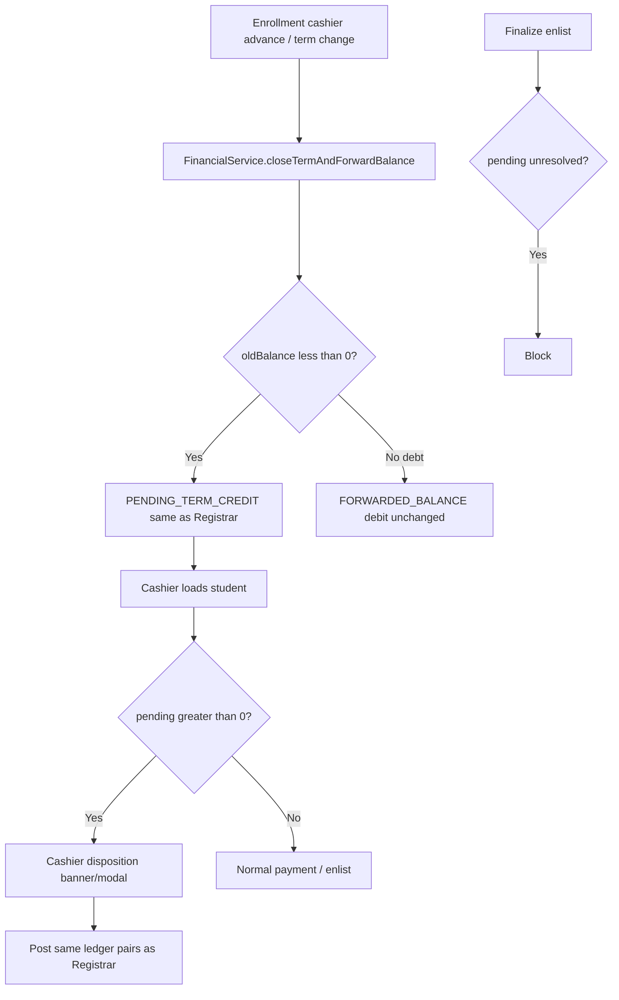

# Implementation Plan — Overpayment (Enrollment phase)

Last updated: 2026-06-10  
**Prerequisite:** Registrar phase 1 **complete** (`IMPLEMENTATION_PLAN_OVERPAYMENT.md`)  
**Bundle:** `61026.2/overpayment/`  
**App:** Enrollment `http://localhost:8082` + shared `eacdb`  
**Estimate:** ~2–3 focused dev days

Business rules: `PROPOSAL_OVERPAYMENT_FORWARD_CREDIT_POLICY.md` (unchanged).

---

## Why this phase exists

Registrar phase 1 handles:

- Bulk **term transition** overpay → `PENDING_TERM_CREDIT`
- Disposition in **Student Manager** (8083)
- Registrar **enrollment hub** block

Enrollment still uses **legacy** behavior on the path most demos use:

| Enrollment path today | Behavior |
|----------------------|----------|
| Cashier **Advance term** / term change | `closeTermAndForwardBalance` → auto `FORWARDED_BALANCE` **credit** |
| Cashier totals | Negative forward **reduces** assessment immediately |
| Enlist finalize | No pending check |

Until this phase ships, **BAL-T04** (overpay → advance via cashier → credit forward) and **OPAY-R07** remain the gap.

---

## What you can test **now** (Registrar only)

| Test | Ready? | How |
|------|--------|-----|
| Disposition UI (refund / credit / split) | **Yes** | Run `13_student_overpay_dispositions.sql`, restart Registrar, seed `demo_overpay_pending.sql`, open **Student Manager** |
| Registrar enrollment hub block | **Yes** | Same seed → `/admin/enrollment?username=…` |
| Term transition → pending | **Yes** | Settings term transition on overpaid student (Session F) |
| Full cashier demo (BAL-T04) | **No** | Needs this Enrollment phase |
| Cashier advance → pending | **No** | Needs `FinancialService` change below |

**Minimum to test Registrar today:**

```cmd
mysql -u root eacdb < registrar\db\demo_scripts\13_student_overpay_dispositions.sql
cd registrar && mvn package -DskipTests
REM restart Registrar on 8083
mysql -u root eacdb < registrar\db\demo_scripts\demo_overpay_pending.sql
```

---

## Registrar phase 1 — completion checklist

| Item | Status |
|------|--------|
| `PENDING_TERM_CREDIT` at registrar term close | **Done** |
| `OverpayDispositionService` | **Done** |
| Student Manager + enrollment hub UI | **Done** |
| `FinanceAdmissionService` pending line | **Done** |
| `student_overpay_dispositions` + `payments.direction` | **Done** (migration script) |
| `OverpayDispositionServiceTest` | **Done** |
| `print_cor` / `student_finance` pending line | **Optional** — not done |
| UAT manual OPAY-R01–R08 written into MASTER_DEMO | **Partial** — see HANDOFF §18 |

**Verdict:** Registrar scoped work is **done** for phase 1. Optional polish and doc sync remain.

---

## Enrollment phase overview



Disposition ledger SQL must **match** Registrar `OverpayDispositionService` byte-for-byte (no shared JAR today).

---

## Phase E1 — Term close parity

**Goal:** Cashier advance posts pending overpay, not auto credit.

### E1.1 `FinancialService.java`

| Change | Detail |
|--------|--------|
| Constants | `PENDING_TERM_CREDIT`, `REFUND_PAYOUT` (mirror `LedgerTransactionTypes` in Registrar) |
| `closeTermAndForwardBalance` | `oldBalance < -0.01` → `PENDING_TERM_CREDIT` credit; return `0.0` (not negative forward) |
| `oldBalance > 0.01` | Unchanged — `FORWARDED_BALANCE` debit |
| **New** `getPendingTermCredit(Student)` | Net `PENDING_TERM_CREDIT` |
| **New** `hasUnresolvedPendingCredit(Student)` | `pending > 0.01` |
| `CLOSABLE_LEDGER_TYPES` | Must **not** delete `PENDING_TERM_CREDIT` |
| `getBalanceForwarded` | Unchanged — `FORWARDED_BALANCE` only |

### E1.2 `EnrollmentController.java`

| Change | Detail |
|--------|--------|
| After advance / term change | Flash note when `getPendingTermCredit > 0` (“Prior-term overpayment pending disposition”) |

### E1.3 Test

`PendingTermCreditTest.java` — close with overpay → pending on ledger, `getBalanceForwarded == 0`.

**E1 exit:** Cashier advance on overpaid student creates `PENDING_TERM_CREDIT` (OPAY-R07 fixed).

---

## Phase E2 — Cashier display + disposition

**Goal:** Cashier shows pending separately; staff can disposition without switching to Registrar.

### E2.1 Assessment math

| Method | Change |
|--------|--------|
| `populateLedgerFinancialData` | Add `pendingTermCredit`, `hasPendingOverpay`; **do not** add pending to `totalAssessment` |
| `forwardComponentForTotalDue` | Unchanged |
| Any other total-due builders | Audit `grep` for `getBalanceForwarded` / `forward_net` |

Files likely affected:

- `FinancialService.populateLedgerFinancialData`
- Methods that build cashier `totalAssessment` (~lines 274, 856, 909)

### E2.2 New service — `OverpayDispositionService.java` (Enrollment)

**Copy** Registrar logic from:

`registrar/src/main/java/com/iuims/registrar/finance/OverpayDispositionService.java`

Adapt to `Student` + `StudentLedgerService` write keys instead of raw `studentNumber` where needed.

Methods:

- `applyAsCredit(Student, amount, decidedBy, remarks)`
- `refundAsCash(Student, amount, decidedBy, remarks)`
- `splitDisposition(...)`

### E2.3 Controller

| Endpoint | File |
|----------|------|
| `POST /admin/overpay/disposition` | `AdminController` |

Params: `studentId`, `action=CREDIT|REFUND|SPLIT`, amounts, `remarks`.

**Alternative (smaller scope):** Cashier banner links to Registrar Student Manager only — **not recommended**; staff expect disposition on 8082.

### E2.4 Templates

| File | Change |
|------|--------|
| `admin_payment.html` | Pending alert + disposition form (match Student Manager UX) |
| `account_status.html` | Read-only pending line |
| `admin-enlistment.html` | Pending banner (optional if enlist gate only) |

### E2.5 Tests

`OverpayDispositionTest.java` — mirror Registrar test vectors.

**E2 exit:** OPAY-E01–E03 (below).

---

## Phase E3 — Enlist gate + advance messaging

**Goal:** Align enlist checkpoint with proposal §4.4.

| Change | File |
|--------|------|
| Block finalize when `hasUnresolvedPendingCredit` | `AdminController.finalizeEnlistment` |
| Flash message with link to cashier disposition | Same |

Registrar enrollment hub already blocks; Enrollment enlist finalize must match.

**E3 exit:** OPAY-E04.

---

## Phase E4 — Reports + docs

| Task | File |
|------|------|
| Monthly summary / remittance net IN − OUT | Enrollment report controllers if they sum `payments` |
| Update BAL-T04 steps | `MASTER_DEMO_UAT_MANUAL.md`, `HUMAN_UAT_CHECKLIST.md` |
| Add OPAY-E01–E05 | Same |
| Changelog | `HANDOFF_UPDATES` §19 |
| Mark Enrollment phase done in roadmap | `PROJECT_STATUS_AND_ROADMAP.md` |

**No new DB migration** if `13_student_overpay_dispositions.sql` already ran for Registrar.

---

## Enrollment file checklist

| File | Phase |
|------|-------|
| `service/FinancialService.java` | E1, E2 |
| `service/OverpayDispositionService.java` | E2 (**new**) |
| `controller/AdminController.java` | E2, E3 |
| `controller/EnrollmentController.java` | E1 |
| `resources/templates/admin_payment.html` | E2 |
| `resources/templates/admin-enlistment.html` | E2, E3 |
| `resources/templates/account_status.html` | E2 (optional) |
| `test/.../PendingTermCreditTest.java` | E1 |
| `test/.../OverpayDispositionTest.java` | E2 |

**Not in scope:** Registrar files (already done).

---

## Build order

```text
Day 1  E1 — FinancialService term close + unit test
Day 2  E2 — OverpayDispositionService + admin_payment UI
Day 3  E3 — enlist gate + E4 docs + BAL-T04 human smoke
```

---

## UAT cases (Enrollment phase)

| ID | Steps | Assert |
|----|-------|--------|
| OPAY-E01 | Overpay → **cashier advance** | `PENDING_TERM_CREDIT`; assessment not reduced |
| OPAY-E02 | OPAY-E01 → cashier **apply credit** | Negative forward; assessment drops |
| OPAY-E03 | OPAY-E01 → cashier **refund** | Pending 0; `REFUND_PAYOUT`; payment OUT |
| OPAY-E04 | Pending undecided → **finalize enlist** | Blocked |
| OPAY-E05 | **BAL-T04** full path via cashier | Matches updated manual |
| OPAY-E06 | Debt forward ≥ threshold | Unchanged block |
| OPAY-E07 | Disposition on **Registrar** still works | No regression (shared ledger) |

---

## Sync rules (critical)

| Rule | Detail |
|------|--------|
| Ledger types | Same strings: `PENDING_TERM_CREDIT`, `REFUND_PAYOUT`, `FORWARDED_BALANCE` |
| Disposition SQL | Keep Enrollment `OverpayDispositionService` identical to Registrar |
| Single DB | Both apps read same `student_ledger`; either app can disposition |
| Do not double-disposition | UI on both apps is OK; validate `amount ≤ pending` on each POST |

---

## Definition of done (Enrollment phase)

- [ ] Cashier advance overpay → `PENDING_TERM_CREDIT`  
- [ ] Cashier assessment excludes pending until credit chosen  
- [ ] Cashier disposition (or explicit link to Registrar if deferred)  
- [ ] Enlist finalize blocked while pending  
- [ ] BAL-T04 updated and smoke-tested  
- [ ] OPAY-E01–E07 pass  
- [ ] HANDOFF + roadmap updated  

---

## Optional deferrals

| Item | Note |
|------|------|
| Cashier disposition UI | Could defer to “use Student Manager on 8083” — leaves OPAY-E02/E03 on cashier untested |
| Student self-service | Out of scope |
| Finance Policy auto-default | Out of scope |
