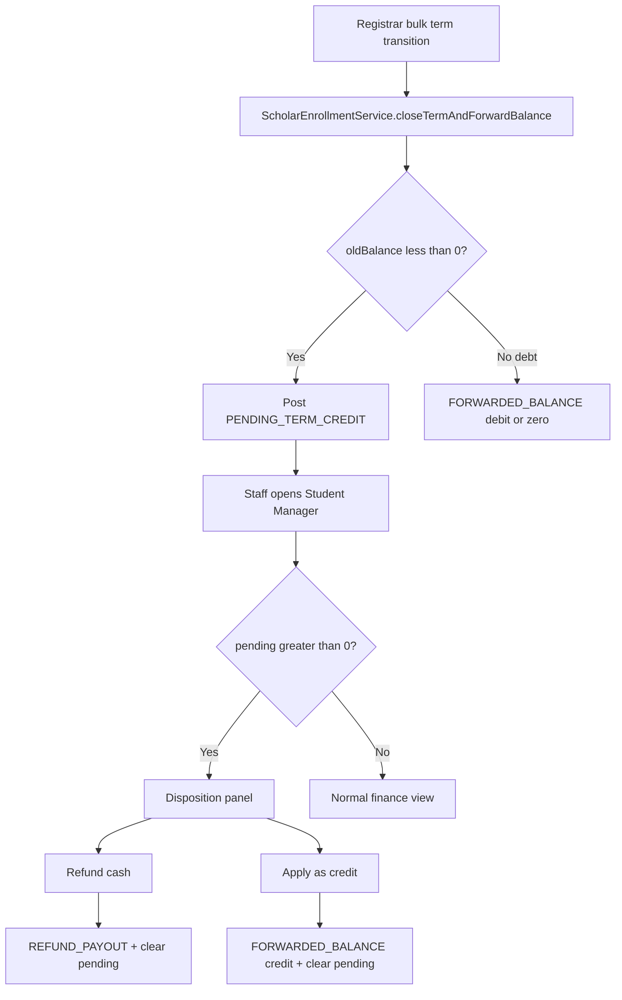

# Implementation Plan — Overpayment (Registrar-only, Phase 1)

Last updated: 2026-06-10  
**Bundle:** `61026.2/overpayment/`  
**Scope:** **`registrar/` only** — Enrollment (`enrollment3/`) **deferred** to a later phase  
**Prerequisite:** `PROPOSAL_OVERPAYMENT_FORWARD_CREDIT_POLICY.md` (business rules unchanged)  
**App:** Registrar `http://localhost:8083/registrar` + shared `eacdb`  
**Estimate:** ~2–3 focused dev days (phases R1–R3); phase R4 docs + UAT +1 day

---

## Scope decision

Build the overpayment feature **only in the Registrar codebase** for now:

| In scope (Registrar) | Deferred (Enrollment) |
|----------------------|------------------------|
| Term close overpay → `PENDING_TERM_CREDIT` via **bulk term transition** | Cashier term advance / `FinancialService.closeTermAndForwardBalance` |
| Student Manager disposition UI | Cashier modal (`admin_payment.html`) |
| Registrar enrollment hub gate | Enrollment enlist finalize gate |
| `FinanceAdmissionService` totals + pending line | `populatePaymentModel` / walk-in payment |
| Registrar ledger / COR / statement display | Enrollment monthly remittance reports |

### Known limitation until Enrollment phase

Students whose term is closed via **Enrollment cashier “Advance term”** will still get **legacy** auto `FORWARDED_BALANCE` credit (today’s behavior). Only closes triggered by **Registrar** (`TermTransitionEvent` → `ScholarEnrollmentService.closeTermAndForwardBalance`) post **pending** overpay.

**Demo / UAT for this phase:** use **Settings → term transition** (Session F) or `demo_overpay_pending.sql` to seed pending rows — not BAL-T04 via cashier advance alone.

---

## Overview (Registrar path)



Disposition is **not** at Enrollment cashier in this phase — Registrar **Student Manager** (and enrollment hub warning) only.

---

## Phase R1 — Ledger + assessment (Registrar)

**Goal:** Registrar term transition posts pending overpay; finance views show pending separately from assessment.

### R1.1 Database (lives under `registrar/db/`)

| Task | Location |
|------|----------|
| `student_overpay_dispositions` table | `registrar/db/demo_scripts/13_student_overpay_dispositions.sql` |
| Fold into fresh bootstrap | `registrar/db/fix` (on next schema bump) |
| Optional: `payments.direction` | Defer to Phase R3 or add column now with default `IN` |

```sql
CREATE TABLE IF NOT EXISTS student_overpay_dispositions (
  disposition_id BIGINT AUTO_INCREMENT PRIMARY KEY,
  student_id VARCHAR(100) NOT NULL,
  source_closing_sl VARCHAR(32) NULL,
  pending_amount DECIMAL(12,2) NOT NULL,
  refunded_amount DECIMAL(12,2) NOT NULL DEFAULT 0.00,
  credited_amount DECIMAL(12,2) NOT NULL DEFAULT 0.00,
  decided_at TIMESTAMP NOT NULL DEFAULT CURRENT_TIMESTAMP,
  decided_by VARCHAR(100) NULL,
  remarks VARCHAR(255) NULL,
  KEY idx_overpay_disp_student (student_id)
) ENGINE=InnoDB DEFAULT CHARSET=utf8mb4;
```

### R1.2 `ScholarEnrollmentService.java`

| Change | Detail |
|--------|--------|
| `closeTermAndForwardBalance` | `oldBalance < -0.01` → `PENDING_TERM_CREDIT` credit (not `FORWARDED_BALANCE` credit) |
| `oldBalance > 0.01` | Unchanged — `FORWARDED_BALANCE` debit |
| **New** `getPendingTermCredit(String studentNumber)` | Net `PENDING_TERM_CREDIT` |
| **New** `hasUnresolvedPendingCredit(String studentNumber)` | `pending > 0.01` |
| `CLOSABLE_LEDGER_TYPES` | Do **not** include `PENDING_TERM_CREDIT` in deletable types |
| `onTermTransition` | Debt counter unchanged — count only `forwarded >= threshold` (pending excluded) |

Constants (class-level or small `LedgerTypes` helper in registrar):

```java
public static final String PENDING_TERM_CREDIT = "PENDING_TERM_CREDIT";
public static final String REFUND_PAYOUT = "REFUND_PAYOUT";
```

### R1.3 `FinanceAdmissionService.java`

| Change | Detail |
|--------|--------|
| `calculateAssessment` | `totalAssessment = termFees + getForwardedBalanceNet()` only |
| **New** map keys | `pending_term_credit`, `pending_term_credit_fmt` |
| Accounting block | Unchanged: `forward_net >= threshold` only |
| `getOutstandingBalanceNet` / related | Exclude pending from assessment |

### R1.4 Read-only display touchpoints

| File | Change |
|------|--------|
| `portal/EnrollmentController.java` (Student Manager GET) | Pass `pendingTermCredit`, `hasPendingOverpay` to model |
| `portal/EnrollmentController.java` (`/admin/enrollment` hub) | Pass pending; extend `canEnroll` logic (Phase R2 gate) |
| `admission/FinanceAdmissionService.getStudentLedger` | Show `PENDING_TERM_CREDIT` / `REFUND_PAYOUT` rows if filtered |
| `templates/admin_student_manager.html` | Finance card: pending line (read-only in R1) |
| `templates/print_cor.html` | Optional pending line (display only) |
| `templates/student_finance.html` | Optional pending line |

### R1.5 Tests

| Class | Cases |
|-------|-------|
| `ScholarEnrollmentServicePendingTest.java` | Overpay close → pending posted, `forward_net == 0` |
| `FinanceAdmissionServicePendingTest.java` | Pending not in `total_assessment` |

**R1 exit:** Bulk transition on overpaid student → `PENDING_TERM_CREDIT` on ledger; Student Manager shows pending; total assessment unchanged.

---

## Phase R2 — Disposition service + Registrar UI

**Goal:** Staff resolve pending overpay from Student Manager; enrollment hub reflects block until resolved.

### R2.1 New service — `finance/OverpayDispositionService.java`

```java
@Transactional
DispositionResult applyAsCredit(String studentNumber, double amount, String decidedBy, String remarks);

@Transactional
DispositionResult refundAsCash(String studentNumber, double amount, String decidedBy, String remarks);

@Transactional
DispositionResult splitDisposition(String studentNumber, double refundAmt, double creditAmt, String decidedBy, String remarks);
```

Ledger postings (per proposal §3.2):

- **Credit:** `PENDING_TERM_CREDIT` debit + `FORWARDED_BALANCE` credit  
- **Refund:** `PENDING_TERM_CREDIT` debit + `REFUND_PAYOUT` debit  
- Insert `student_overpay_dispositions` audit row  

Inject `ScholarEnrollmentService` for balance reads; use `JdbcTemplate` / existing `db` pattern.

### R2.2 Controller — `portal/EnrollmentController.java`

| Endpoint | Purpose |
|----------|---------|
| `POST /admin/student-manager/overpay-disposition` | `action=CREDIT\|REFUND\|SPLIT`, amounts, `studentNumber` |
| Student Manager GET | Banner when `hasUnresolvedPendingCredit` |
| `/admin/enrollment` GET | Set `canEnroll = false` when pending unresolved (in addition to accounting block) |
| Flash messages | Success / validation errors |

Optional: `ScholarController` — show pending in scholar enlist block message (informational only).

### R2.3 Templates

| File | Change |
|------|--------|
| `admin_student_manager.html` | Alert + modal/form: refund / apply credit / split |
| `admin_enrollment.html` | Card when pending: “Resolve overpayment in Student Manager” + link |

No Enrollment templates in this phase.

### R2.4 Tests

| Test | Assert |
|------|--------|
| Apply credit ₱2,500 | pending 0, forward_net −2500, assessment drops |
| Refund ₱2,500 | pending 0, `REFUND_PAYOUT` on ledger |
| Split | partial pending remains |
| Enrollment hub | `canEnroll` false while pending > 0 |

**R2 exit:** OPAY-R01–R04 (see below) pass via Student Manager.

---

## Phase R3 — Refund payout audit (Registrar)

**Goal:** Cash refunds auditable in shared `payments` table and registrar views.

### R3.1 Schema

```sql
ALTER TABLE payments
  ADD COLUMN IF NOT EXISTS direction VARCHAR(10) NOT NULL DEFAULT 'IN'
  COMMENT 'IN=collection, OUT=refund payout';
```

Add to `registrar/db/fix` + migration script.

### R3.2 `OverpayDispositionService.refundAsCash`

- Insert `payments`: `direction='OUT'`, `status='COMPLETED'`, `reference_number=studentNumber`, OR + remarks  
- Keep `REFUND_PAYOUT` ledger debit  

### R3.3 Registrar reporting (minimal)

| Area | Change |
|------|--------|
| Student Manager payment history | Include OUT rows if shown |
| `FinanceAdmissionService` / ledger export | Label refund payouts |

Enrollment remittance reports **unchanged** this phase.

**R3 exit:** Refund visible in ledger + payments table query from Student Manager.

---

## Phase R4 — UAT, demo SQL, docs

| Task | File |
|------|------|
| Registrar-focused OPAY cases | This doc § UAT table |
| Demo seed | `registrar/db/demo_scripts/demo_overpay_pending.sql` |
| Note Session F + Student Manager path | `../handoffNew/MASTER_DEMO_UAT_MANUAL.md` |
| Changelog | `../handoffNew/HANDOFF_UPDATES_20260609.md` |
| Roadmap | `../handoffNew/PROJECT_STATUS_AND_ROADMAP.md` |
| Future Enrollment phase | `IMPLEMENTATION_PLAN_OVERPAYMENT_ENROLLMENT.md` (create when starting phase 2) |

---

## Registrar file checklist

| File | Phase |
|------|-------|
| `scholarship/ScholarEnrollmentService.java` | R1 |
| `admission/FinanceAdmissionService.java` | R1, R3 |
| `finance/OverpayDispositionService.java` | R2 (**new**) |
| `portal/EnrollmentController.java` | R1, R2 |
| `portal/ScholarController.java` | R2 (optional) |
| `jaypee/JaypeeIntegrationService.java` | R1 (only if forward display used for gating) |
| `resources/templates/admin_student_manager.html` | R1, R2 |
| `resources/templates/admin_enrollment.html` | R2 |
| `resources/templates/print_cor.html` | R1 (optional) |
| `resources/templates/student_finance.html` | R1 (optional) |
| `db/demo_scripts/13_student_overpay_dispositions.sql` | R1 |
| `db/demo_scripts/demo_overpay_pending.sql` | R4 |
| `db/fix` | R1, R3 |
| `test/.../ScholarEnrollmentServicePendingTest.java` | R1 |
| `test/.../OverpayDispositionServiceTest.java` | R2 |

**Not touched:** entire `enrollment3/` tree.

---

## Build order

```text
Day 1   R1 — SQL + ScholarEnrollmentService + FinanceAdmissionService + unit tests
Day 2   R2 — OverpayDispositionService + Student Manager UI + enrollment hub gate
Day 3   R3 — payments.direction OUT + refund audit smoke
Day 4   R4 — demo SQL + doc updates + human UAT (Registrar paths only)
```

---

## UAT cases (Registrar-only)

| ID | Steps | Assert |
|----|-------|--------|
| OPAY-R01 | Overpay student → **Registrar term transition** → open Student Manager | `PENDING_TERM_CREDIT` on ledger; pending shown; assessment not reduced |
| OPAY-R02 | OPAY-R01 → Student Manager → **Apply as credit** | Pending 0; negative `FORWARDED_BALANCE`; assessment reduced |
| OPAY-R03 | OPAY-R01 → **Refund cash** | Pending 0; `REFUND_PAYOUT`; `payments.direction=OUT` |
| OPAY-R04 | Split refund + credit | Partial clear; balances correct |
| OPAY-R05 | Debt forward ≥ threshold | No overpay UI; accounting block unchanged |
| OPAY-R06 | `/admin/enrollment` with pending | `canEnroll` false; message links to Student Manager |
| OPAY-R07 | Cashier advance only (Enrollment) | **Legacy** auto credit — document as expected gap |
| OPAY-R08 | Term close with no overpay | Unchanged |

---

## Risks and mitigations

| Risk | Mitigation |
|------|------------|
| Two term-close paths diverge | Document OPAY-R07; plan Enrollment phase; cross-ref in code comments |
| Staff only use Enrollment cashier | Train: resolve overpay in Student Manager; or run term transition from Registrar |
| Legacy negative `FORWARDED_BALANCE` | Leave as-is; no re-prompt |
| LOA student never opens enrollment hub | Student Manager still allows disposition |
| Bulk transition volume | Passive pending; no per-student modal in batch |

---

## Definition of done (Registrar-only)

- [ ] Registrar term transition overpay → `PENDING_TERM_CREDIT` (not auto forward credit)  
- [ ] `FinanceAdmissionService` excludes pending from `total_assessment`  
- [ ] Student Manager: view pending + refund / credit / split  
- [ ] Enrollment hub blocks advising enroll while pending unresolved  
- [ ] Refund posts `REFUND_PAYOUT` + `payments` OUT row  
- [ ] Debt forward + accounting block threshold unchanged  
- [ ] OPAY-R01–R06 smoke-tested  
- [ ] Enrollment gap documented (OPAY-R07)  
- [ ] `HANDOFF_UPDATES` + roadmap updated  

---

## Future — Enrollment phase

**See:** `IMPLEMENTATION_PLAN_OVERPAYMENT_ENROLLMENT.md` (isolated Enrollment-only plan, ~2–3 days).

Registrar phase 1 status: **complete** (HANDOFF §18). Test via migration + `demo_overpay_pending.sql` or term transition; full BAL-T04 cashier path waits on Enrollment phase.

---

## Not in this plan

- Any `enrollment3/` code or templates  
- Finance Policy new keys  
- Applicant admission overpay  
- Spring Security (deferred)  
- Student self-service disposition  
